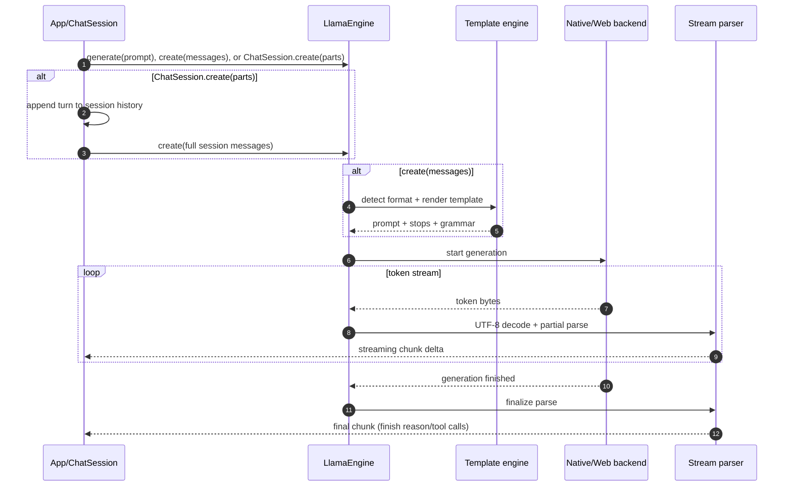

`llamadart` exposes three generation entry points:

- `engine.generate(prompt)` for raw prompt strings.
- `engine.create(messages)` for stateless, chat-template aware completions.
- `ChatSession.create(parts)` for stateful, multi-turn chat with automatic
  history management.

## Choosing the right API

| API | Template-aware? | Keeps history? | Use when |
| --- | --- | --- | --- |
| `engine.generate(prompt)` | No | No | You already rendered the final raw prompt, or you are benchmarking, testing prefix-cache/state flows, or doing other low-level runtime work. |
| `engine.create(messages)` | Yes | No | You have the complete `List<LlamaChatMessage>` for each request, such as an OpenAI-compatible server, a one-shot completion, or an app that owns its transcript. |
| `ChatSession.create(parts)` | Yes | Yes | You are building a multi-turn chat UI/CLI and want the SDK to append user/assistant turns, apply the system prompt, and trim history as the context grows. |

For beginner or one-shot instruction examples, prefer `engine.create(...)` so the
model's chat template is applied without introducing session state. For real
chat applications, prefer `ChatSession` unless your app already stores and sends
the full message list itself.

## Generation pipeline (visual)



## Low-level generation API

```dart
await for (final token in engine.generate(
  'List two advantages of local LLM inference.',
  params: const GenerationParams(maxTokens: 64, temp: 0.4),
)) {
  print(token);
}
```

## Chat completion API

```dart
final messages = [
  LlamaChatMessage.fromText(
    role: LlamaChatRole.user,
    text: 'Explain top-p in plain language.',
  ),
];

await for (final chunk in engine.create(
  messages,
  params: const GenerationParams(maxTokens: 128, topP: 0.95),
)) {
  final thinking = chunk.choices.first.delta.thinking;
  if (thinking != null) {
    print('[thinking] $thinking');
  }

  final text = chunk.choices.first.delta.content;
  if (text != null) {
    print(text);
  }
}
```

## Structured JSON output

Use `LlamaStructuredOutput` when you want strict JSON plus final validation and
typed decoding. The helper builds the `responseFormat` map for grammar-capable
backends and validates the completed model output before returning your value.

```dart
class TicketClassification {
  TicketClassification({required this.priority, required this.category});

  final String priority;
  final String category;

  static TicketClassification fromJson(Map<String, dynamic> json) {
    return TicketClassification(
      priority: json['priority'] as String,
      category: json['category'] as String,
    );
  }
}

final output = LlamaStructuredOutput<TicketClassification>.jsonSchema(
  schema: const {
    'type': 'object',
    'properties': {
      'priority': {
        'type': 'string',
        'enum': ['low', 'medium', 'high'],
      },
      'category': {'type': 'string'},
    },
    'required': ['priority', 'category'],
    'additionalProperties': false,
  },
  decoder: TicketClassification.fromJson,
);

final classification = await engine.createStructuredJson(
  [
    LlamaChatMessage.fromText(
      role: LlamaChatRole.user,
      text: 'Classify this ticket: checkout fails with card declined.',
    ),
  ],
  output: output,
  params: const GenerationParams(maxTokens: 96, temp: 0),
);
```

For live rendering, call `engine.create(..., responseFormat:
output.responseFormat)` and then finalize the stream with
`parseStructuredJson(output)`. Validation is a final-output step because partial
stream chunks are often not valid JSON yet.

Supported schema features match the built-in JSON-schema-to-GBNF subset:
primitive types, objects with `properties`, `required`, and
`additionalProperties`, arrays with `items` or fixed `prefixItems`,
`enum`/`const`, local `$ref`, `anyOf`, `oneOf`, `allOf`, `minLength`,
`maxLength`, `minItems`, and `maxItems`. Unsupported schemas fail before
generation. Annotation metadata such as `title`, `description`, and `default`
is preserved but not enforced as a decoding constraint. Backends without
grammar constraints, including current LiteRT-LM native and web paths, still
fail early for strict structured output.

## `create(...)` flow at a glance

1. Build your `List<LlamaChatMessage>`.
2. `engine.create(...)` runs template rendering/parity logic.
3. Effective stop sequences and grammar are applied to generation params.
4. Backend token bytes are decoded and emitted as streaming chunks.
5. Final parse resolves tool calls and stop reason.

## Cancellation

```dart
engine.cancelGeneration();
```

Cancellation is immediate and backend-specific.

## Tokenization helpers

```dart
final tokens = await engine.tokenize('hello world');
final text = await engine.detokenize(tokens);
final count = await engine.getTokenCount('hello world');
```

These helpers are useful for context budgeting and prompt diagnostics.

## Stateless vs stateful chat

`engine.create(...)` is stateless: it uses exactly the messages you pass for that
request and does not remember the assistant response. If you want a follow-up
turn to see prior context, append both the user message and assistant response to
your own `messages` list before calling `engine.create(...)` again.

`ChatSession.create(...)` is stateful: it adds the new user content to session
history, streams through `engine.create(...)`, then stores the assistant message
for later turns. Use `session.addMessage(...)` when you need to restore history or
insert tool results manually, and `session.reset(...)` when a conversation should
start over.

See [First Chat Session](../getting-started/first-chat-session) for a minimal
multi-turn example.
