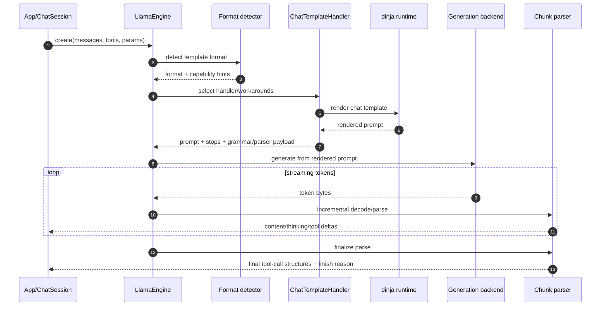

`llamadart` reimplements the `llama.cpp` chat-template/render/parse stack in
Dart so routing and parser behavior stay consistent across native and web
targets.

## Design goal

The template system prioritizes llama.cpp parity:

- format detection behavior
- handler routing logic
- tool-grammar attachment rules
- parse behavior for thinking and tool-call envelopes

## End-to-end pipeline

## Main components

### 1. Format detection

- `ChatTemplateEngine` detects format from template signatures.
- Each detected format maps to a concrete `ChatTemplateHandler`.
- Handlers live under `lib/src/core/template/handlers/`.

### 2. Template capabilities and routing

- `TemplateCaps` reports whether a template supports system role, tools,
  tool calls, parallel tool calls, string and typed content, object
  arguments, and thinking channels.
- `JinjaAnalyzer` detects all but thinking with llama.cpp's capability
  probes: it renders llama.cpp's probe conversations and records which values
  the template reads. Thinking support comes from the template's thinking
  markers.
- Routing workarounds mirror llama.cpp behavior for schema mode, tool-choice
  behavior, and system-message adaptation.

### 3. Render stage

- Handler `render(...)` builds the final prompt and metadata payload.
- Result includes:
  - prompt text
  - stop sequences
  - optional grammar
  - optional PEG parser payload
  - preserved tokens and lazy grammar triggers

### 4. Parse stage

- During streaming, partial output is parsed incrementally for content/thinking
  deltas and tool-call envelopes.
- On completion, final parse produces stable tool-call structures and finish
  reason semantics.
- PEG-backed parse paths are used when parser payloads are present.

## Tool-call parsing

Qwen XML tool calls are validated against the tools supplied to `engine.create`.
Schema-declared strings such as `"123"` retain their type. Unknown functions,
unknown or duplicate parameters, missing required values, and invalid value
types remain response content instead of producing callable tool deltas.
Tool calls are emitted after final validation; malformed output is preserved
through the existing rollback behavior. Direct schema-free template parsing
retains its legacy behavior, so pass tool definitions when validating calls.

Without a tool-call grammar, as with `ToolChoice.auto` on WebGPU, Qwen2.5 can
copy the double braces its GGUF template prints in the tool prompt:
`<tool_call>{{"name": "get_weather", "arguments": {"city": "Paris"}}}</tool_call>`,
sometimes with fewer or more closing braces. The Hermes/Qwen parser extracts
the call. When only closing braces and whitespace follow the call before
`</tool_call>`, the envelope leaves no content, as for the single-brace form;
otherwise its text stays in content. This deliberately differs from upstream
llama.cpp (`7fe450e1`), which fails to parse this output and returns no tool
call.

When tool calls are parsed, streamed content equals the content of the final
parse for Hermes, Mistral Nemo, Magistral, Qwen3-Coder XML, DeepSeek R1 and
V3, Command R7B, Cohere2 MoE, Granite, Nemotron V2, Apertus, MiniCPM5,
Hunyuan V3 and EXAONE MoE output, and for Seed-OSS, MiniMax M2, Apriel 1.5
and Xiaomi MiMo output without a forced-open thought; those four parses
ignore one. Text from where the format's parse may find a tool-call opening,
and trailing whitespace, is held until later output rules the opening out or
generation ends, as llama.cpp (`7fe450e1`) PEG `until` stops content before a
whole delimiter or a partial one at the end of the input. With Qwen3-Coder
XML, a `<tool_call>` also ends a forced-open thought when the output has no
thinking tag, as its parse does. Such a thought keeps an escaped `\n` or
`\r`, so from the first one on, a forced-open Qwen3-Coder XML thought waits
for the call, `</think>` or the end of generation. As in the parse, a start
tag the model repeats at the start of a forced-open thought is dropped, and
when the output has no start tag, an end tag after the first one is content.

Streamed reasoning equals the parse too, which trims each thought;
upstream llama.cpp (`7fe450e1`) keeps the whitespace before `</think>`, so
with the Qwen3 template it returns `"Plan it.\n"` for
`<think>\nPlan it.\n</think>`. The one exception is a forced-open thought
that never closes and starts with whitespace. The parse keeps it untrimmed,
but the stream drops the leading whitespace before it can know the thought
will not close. The streamed text is then no prefix of the parse, so the final
reconciliation adds nothing and the trailing whitespace is lost too:
`"  \n Hello there.  \n\n"` streams as `"Hello there."`. The DeepSeek V3 and
EXAONE MoE parses return a forced-open thought that never closes as content,
so its reasoning waits for `</think>`; if the thought never closes, it arrives
as content at the end of the stream.

Output parsed with a PEG parser (Ministral, Solar Open, Nemotron V3, or
Qwen3-Coder XML given a parser) streams the content and reasoning of partial
PEG parses, which hold back a possible opening themselves. A Ministral
thought cut off by the token limit therefore streams as reasoning, although
the final parse returns it, with its `[THINK]` tag, as content.

## `dinja` integration

`llamadart` uses [`dinja`](https://pub.dev/packages/dinja), the Dart Jinja
runtime used as the execution layer for model-provided chat templates
(`tokenizer.chat_template`).

`dinja` was built in the `llamadart` ecosystem as a Dart port of the
llama.cpp-style minimal Jinja execution model, then used as the foundation of
the template engine in this package.

Inside `llamadart`, the `jinja/` integration layer acts as the Dinja-plugin
surface: it wires llama.cpp-specific globals and capability analysis into
template execution.

Why this matters:

- no Python runtime dependency in app environments
- on-device template rendering in pure Dart
- reusable lexer/parser access for capability analysis (`JinjaAnalyzer`)

In practice, our template integration stack is:

1. `dinja` template execution for render.
2. `llamadart` routing/parity logic around it.
3. `llamadart` parser/grammar infrastructure for streamed output.

## Practical debugging flow

1. Call `engine.chatTemplate(...)` to inspect prompt/format/stops.
2. Verify tool schema and grammar expectations before generation.
3. Compare parsed output in partial vs final streaming stages.
4. Re-test after model/runtime upgrades to catch routing shifts early.

## Related docs

- [Chat Templates and Parsing](./chat-template-and-parsing)
- [Tool Calling](./tool-calling)
- [Generation and Streaming](./generation-and-streaming)
