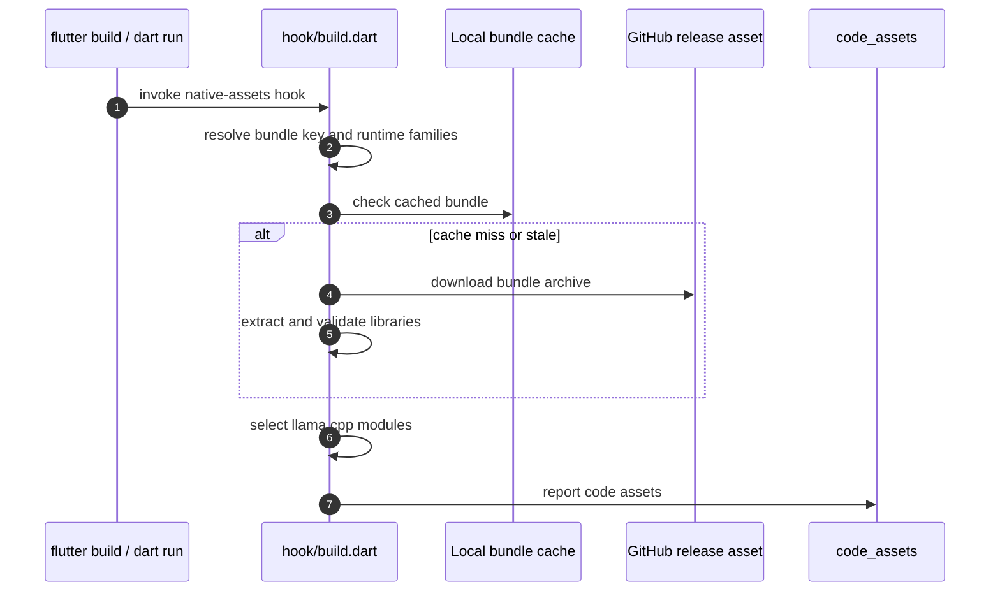

The `llamadart` build hook (`hook/build.dart`) downloads prebuilt llama.cpp and
LiteRT-LM runtimes for the target platform, so apps never compile C++. The hook
reports the downloaded `.so`, `.dylib` and `.dll` files as `package:code_assets`
code assets, and the Flutter or Dart build bundles them into the APK, IPA or
desktop app. On macOS, LiteRT-LM libraries stay in the hook cache and load from
there.

Configure the hook under `hooks.user_defines.llamadart` in the app's
`pubspec.yaml`. Every key is optional:

| Key | Selects | Default |
| --- | --- | --- |
| `llamadart_native_runtimes` | Runtime families to bundle: `llama_cpp`, `litert_lm` | Every family published for the target |
| `llamadart_native_backends` | llama.cpp backend modules, and Android arm64 CPU variants | `cpu` and `vulkan` where present |
| `llamadart_native_tag` | `leehack/llamadart-native` release to download | The [pinned release](./support-matrix#pinned-runtimes) |
| `llamadart_native_repository` | GitHub repository to download llama.cpp bundles from | `leehack/llamadart-native` |
| `llamadart_native_path` | Local archive or bundle directory used instead of a download | Unset |

```yaml
hooks:
  user_defines:
    llamadart:
      llamadart_native_runtimes: [llama_cpp]
      llamadart_native_backends:
        platforms:
          android-arm64:
            backends: [vulkan]
            cpu_profile: compact
          linux-x64: [vulkan, cuda]
          windows-x64: [vulkan, cuda, blas]
```

After changing any of these keys, or after a native release tag is republished
with new assets, run `flutter clean` once so stale native assets are not
reused.

## Choose runtime families

`llamadart_native_runtimes` keeps whole runtimes out of the app when it ships
only one model format. The value is a list, or a map with a top-level
`runtimes` list and per-platform overrides under `platforms`:

```yaml
hooks:
  user_defines:
    llamadart:
      llamadart_native_runtimes:
        runtimes: [llama_cpp, litert_lm]
        platforms:
          ios: [llama_cpp]
          android-arm64: [litert_lm]
```

- Platform keys are OS names (`android`, `ios`, `linux`, `macos`, `windows`) or
  bundle keys such as `android-arm64` or `ios-arm64-sim`. For each bundle the
  exact bundle key wins, then its OS key, then `runtimes`, then every family.
- Aliases: `gguf`, `llama`, `llama.cpp` for `llama_cpp`; `litert`,
  `litert-lm`, `litertlm`, `.litertlm` for `litert_lm`. `all` and `both` select
  every family. Unknown names are dropped with a warning.
- Selecting `litert_lm` by name for a target without a LiteRT-LM runtime, such
  as the iOS x86_64 simulator or Windows arm64, fails the build. When it is only
  implied by the default or `all`, the hook drops it with a warning.
- A selection that leaves no runtime fails the build.

## Choose llama.cpp backend modules

`llamadart_native_backends` filters the split llama.cpp modules inside the
`llama_cpp` family; it does not affect LiteRT-LM. It is set per platform,
under `platforms` or as a map keyed by platform. A platform value is a list, a
comma-separated string, or a map with a `backends` list. A bare top-level list
applies to no platform.

Modules in the pinned bundles:

| Bundle | Modules |
| --- | --- |
| `android-arm64`, `android-x64` | `cpu`, `vulkan`, `opencl` |
| `linux-arm64` | `cpu`, `vulkan`, `blas` |
| `linux-x64` | `cpu`, `vulkan`, `blas`, `cuda`, `hip` |
| `windows-arm64` | `cpu`, `vulkan`, `blas` |
| `windows-x64` | `cpu`, `vulkan`, `blas`, `cuda` |
| `ios-*`, `macos-*` | One consolidated CPU and Metal runtime; not configurable |

Aliases: `vk` for `vulkan`; `ocl` and `open-cl` for `opencl`.
`GpuBackend.metal` still selects Metal at runtime on Apple targets.

Selection rules:

- With no request, the hook bundles `cpu` and `vulkan`, where present.
- `cpu` is always added when the bundle has it.
- A request that names any module the bundle lacks is rejected whole: the hook
  warns and uses the defaults. If the defaults are missing too, it bundles every
  module.
- CUDA runtime DLLs (`cudart64_*`, `cublas64_*`, `cublaslt64_*`) ship only with
  `cuda`, and OpenBLAS libraries only with `blas`.
- On `windows-x64`, the hook rejects a bundle whose `cuda` module lacks the
  cudart and cuBLAS DLLs, or whose `blas` module lacks OpenBLAS.

Linux modules need system libraries; see
[Linux prerequisites](./linux-prerequisites).

### Android arm64 CPU variants

The `android-arm64` map form also takes `cpu_profile` and `cpu_variants`:

- `cpu_profile: full` (default) bundles all seven CPU variant modules.
- `cpu_profile: compact` bundles only the baseline `android_armv8.0_1`.
- `cpu_variants: [...]` lists variants explicitly and overrides `cpu_profile`.
  Unknown entries are dropped with a warning; if none remain, `cpu_profile`
  applies.

| Variant | Optional CPU features |
| --- | --- |
| `android_armv8.0_1` | Baseline |
| `android_armv8.2_1` | `DOTPROD` |
| `android_armv8.2_2` | `DOTPROD`, `FP16_VECTOR_ARITHMETIC` |
| `android_armv8.6_1` | `DOTPROD`, `FP16_VECTOR_ARITHMETIC`, `MATMUL_INT8` |
| `android_armv9.0_1` | `DOTPROD`, `FP16_VECTOR_ARITHMETIC`, `MATMUL_INT8`, `SVE2` |
| `android_armv9.2_1` | `DOTPROD`, `FP16_VECTOR_ARITHMETIC`, `MATMUL_INT8`, `SVE`, `SME` |
| `android_armv9.2_2` | `DOTPROD`, `FP16_VECTOR_ARITHMETIC`, `MATMUL_INT8`, `SVE`, `SVE2`, `SME` |

Variant names are normalized, so `baseline`, `armv8_6_1`, `v9_0_1`,
`android-armv9.2_2` and `libggml-cpu-android_armv8.2_2.so` are all accepted.

## Override the llama.cpp release

```yaml
hooks:
  user_defines:
    llamadart:
      llamadart_native_tag: vX.Y.Z
      llamadart_native_repository: leehack/llamadart-native
      # llamadart_native_path: ./native-bundles
```

- `llamadart_native_tag` names a `llamadart-native` release tag, not a
  `llamadart` package version. The hook accepts `vMAJOR.MINOR.PATCH`,
  `vMAJOR.MINOR.PATCH-N`, `bNNNN`, `bNNNN-N` and `bNNNN-llamadart.N`, never
  `latest`. List releases with
  `gh release list --repo leehack/llamadart-native --limit 20`.
- The release must contain `llamadart-native-<bundle>-<tag>.tar.gz` for the
  target; otherwise the download fails the build.
- `llamadart_native_repository` takes an `owner/repo` slug or a
  `https://github.com/owner/repo` URL.
- `llamadart_native_path` wins over downloads. It can point at an archive, an
  extracted bundle directory, or a directory containing `<tag>/<bundle>/`,
  `<bundle>/`, or the expected archive. Relative paths resolve from the
  `pubspec.yaml` that sets them.

Overrides do not regenerate the Dart FFI bindings, so the binary must stay ABI-
and symbol-compatible with the pinned release; the hook logs a warning when an
override is active. Two checks fail closed:

- LoRA adapters need both `llama_adapter_get_alora_n_invocation_tokens` and
  `llama_adapter_get_alora_invocation_tokens`. Without a compatible pair,
  `setLora` throws `LlamaUnsupportedException` rather than activate an adapter
  whose type it cannot check.
- DSpark speculative decoding (`SpeculativeDecodingConfig.draftDspark`) needs
  at least the `b10356-llamadart.1` wrapper fix; the pinned release has it.

LiteRT-LM has no override keys; the hook always downloads the pinned
`litert-lm-native` release and verifies its checksum. Tag grammar for
maintainers: [Native and web sync](../maintainers/native-and-web-sync).

## Flutter Apple apps

Flutter iOS and macOS apps link runtimes through Swift Package Manager when a
companion package is a dependency:

- `llamadart_llama_cpp_flutter` links the llama.cpp XCFrameworks.
- `llamadart_litert_lm_flutter` links the LiteRT-LM iOS XCFrameworks.

When a companion is present, the installed companions choose the Apple runtime
families and `llamadart_native_runtimes` is ignored with a warning. The tag,
repository, path and backend keys do not change SwiftPM binaries; their pins
live in each companion's `Package.swift`, so use a path or git override or a
fork of the companion. Flutter macOS LiteRT-LM still uses the hook-managed
runtime. Without a companion, and for non-Flutter or non-Apple builds, the hook
path above applies.

Standalone Dart on macOS keeps LiteRT-LM libraries in the hook cache. A custom
launcher can set `LLAMADART_LITERT_LM_LIB_DIR` to the extracted LiteRT-LM
directory.

## How the hook resolves a build



Runtime sources: llama.cpp bundles come from
[`leehack/llamadart-native`](https://github.com/leehack/llamadart-native) and
LiteRT-LM bundles from
[`leehack/litert-lm-native`](https://github.com/leehack/litert-lm-native).
The hook checks each LiteRT-LM archive for its required libraries and
downloads it again when a cached copy is corrupt or incomplete. Which
repository owns which change: [Runtime ownership](../maintainers/runtime-ownership).
