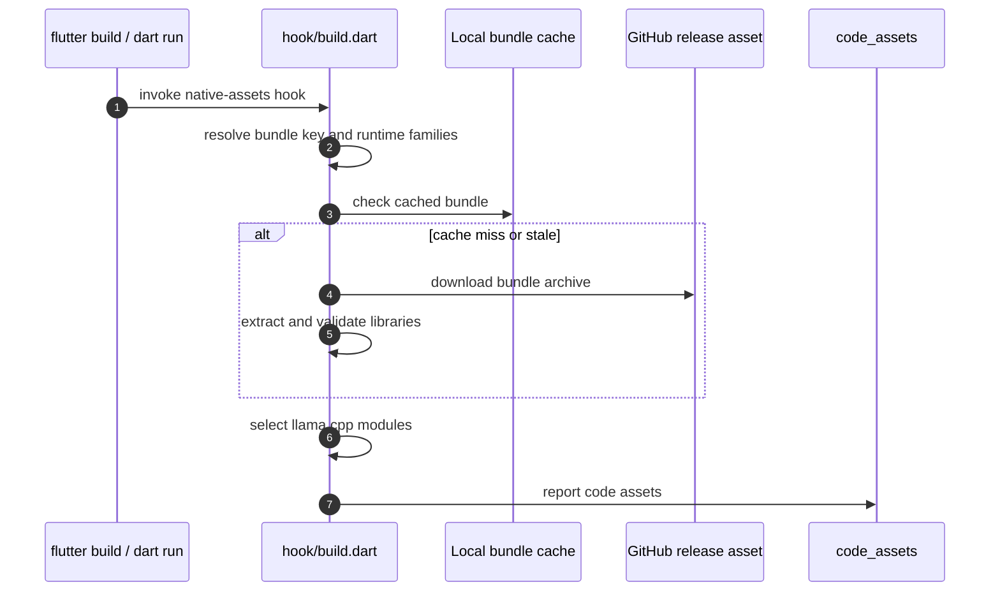

The `llamadart` build hook (`hook/build.dart`) downloads prebuilt llama.cpp and
LiteRT-LM runtimes for the target platform, so apps never compile C++. The hook
reports the downloaded `.so`, `.dylib` and `.dll` files as `package:code_assets`
code assets, and the Flutter or Dart build bundles them into the APK, IPA or
desktop app. On macOS, LiteRT-LM libraries stay in the hook cache and load from
there.

Configure the hook under `hooks.user_defines.llamadart` in the app's
`pubspec.yaml`. Every key is optional:

| Key | Selects | Default |
| --- | --- | --- |
| `llamadart_native_runtimes` | Runtime families to bundle: `llama_cpp`, `litert_lm`, and the opt-in `stable_diffusion` | `llama_cpp` and `litert_lm` where published |
| `llamadart_native_backends` | llama.cpp backend modules, and Android arm64 CPU variants | `cpu` and `vulkan` where present |
| `llamadart_stable_diffusion_backends` | The `stable_diffusion` build on Linux and Windows: `cpu` or `vulkan` | Follows `llamadart_native_backends` |
| `llamadart_native_tag` | `leehack/llamadart-native` release to download | The [pinned release](./support-matrix#pinned-runtimes) |
| `llamadart_native_repository` | GitHub repository to download llama.cpp bundles from | `leehack/llamadart-native` |
| `llamadart_native_path` | Local archive or bundle directory used instead of a download | Unset |

```yaml
hooks:
  user_defines:
    llamadart:
      llamadart_native_runtimes: [llama_cpp]
      llamadart_native_backends:
        platforms:
          android-arm64:
            backends: [vulkan]
            cpu_profile: compact
          linux-x64: [vulkan, cuda]
          windows-x64: [vulkan, cuda, blas]
```

After changing any of these keys, or after a native release tag is republished
with new assets, run `flutter clean` once so stale native assets are not
reused.

## Choose runtime families

`llamadart_native_runtimes` keeps whole runtimes out of the app when it ships
only one model format. The value is a list, or a map with a top-level
`runtimes` list and per-platform overrides under `platforms`:

```yaml
hooks:
  user_defines:
    llamadart:
      llamadart_native_runtimes:
        runtimes: [llama_cpp, litert_lm]
        platforms:
          ios: [llama_cpp]
          android-arm64: [litert_lm]
```

- Platform keys are OS names (`android`, `ios`, `linux`, `macos`, `windows`) or
  bundle keys: `android-arm64`, `android-x64`, `ios-arm64`, `ios-arm64-sim`,
  `ios-x86_64-sim`, `linux-arm64`, `linux-x64`, `macos-arm64`,
  `macos-x86_64`, `windows-arm64` and `windows-x64`. For each bundle the
  exact bundle key wins, then its OS key, then `runtimes`, then every family.
- Aliases: `gguf`, `llama`, `llama.cpp` for `llama_cpp`; `litert`,
  `litert-lm`, `litertlm`, `.litertlm` for `litert_lm`; `stable-diffusion` for
  `stable_diffusion`. `all` and `both` select `llama_cpp` and `litert_lm`.
  Unknown names are dropped with a warning.
- Selecting `litert_lm` by name for a target without a LiteRT-LM runtime, such
  as the iOS x86_64 simulator or Windows arm64, fails the build. When it is only
  implied by the default or `all`, the hook drops it with a warning.
- An empty or all-unknown selection falls back to `llama_cpp` and
  `litert_lm`; one that leaves no runtime, such as `none`, fails the build.

### Opt-in stable_diffusion runtime (experimental)

`stable_diffusion` bundles the
[stable-diffusion.cpp](https://github.com/leejet/stable-diffusion.cpp) runtime
from `leehack/stable-diffusion-native` for the experimental
[`ImageGenerationEngine`](../guides/image-generation). It adds about 40 to
70 MB per target, so it is never bundled by default or by `all`/`both`; name it
explicitly:

```yaml
hooks:
  user_defines:
    llamadart:
      llamadart_native_runtimes:
        runtimes: [llama_cpp, stable_diffusion]
```

- Published for `android-arm64`, `ios-arm64`, `ios-arm64-sim`,
  `ios-x86_64-sim`, `macos-arm64`, `macos-x86_64`, `linux-arm64`, `linux-x64`
  and `windows-x64`, built for iOS
  16.4 and macOS 13.3 or newer. At run time the engine checks the CPU before
  loading the library: Android needs an Armv8.2 CPU with dot-product and fp16
  (`asimddp`, `fphp`, `asimdhp`), and Linux and Windows x64 need AVX2, FMA,
  F16C and BMI2. Otherwise `ImageGenerationEngine.load` throws
  `LlamaUnsupportedException` instead of crashing on an illegal
  instruction. On Windows the runtime also needs the latest Microsoft Visual
  C++ v14 Redistributable (x64); stock Windows Server lacks it, and the
  error names the DLL that failed to load.
- Apple builds use the Metal build and Android the CPU build. Linux and Windows
  publish a CPU build (about 38 MB) and a Vulkan build (about 72 MB) that needs
  the system Vulkan loader (`libvulkan.so.1` or `vulkan-1.dll`) at run time.
  `llamadart_stable_diffusion_backends` picks one, as a list for every
  platform or a `platforms` map like `llamadart_native_backends`:

  ```yaml
  hooks:
    user_defines:
      llamadart:
        llamadart_stable_diffusion_backends: [cpu]
        # or per platform:
        # llamadart_stable_diffusion_backends:
        #   platforms:
        #     linux: [vulkan]
        #     windows: [cpu]
  ```

  It accepts `cpu` and `vulkan` (alias `vk`) and leaves the llama.cpp
  backends unchanged. A list naming `vulkan` selects the Vulkan build even
  when it also names `cpu`. Without an entry for the platform, or with an
  empty one, the build follows `llamadart_native_backends` for the same
  platform: Vulkan when Vulkan is selected there, which is the default, and
  CPU otherwise. A value naming neither `cpu` nor `vulkan` is ignored with a
  build warning and the same fallback applies.
- Other targets, such as `android-x64` or Windows arm64, are skipped with a
  warning. Naming it for that exact bundle key, for example
  `android-x64: [stable_diffusion]`, fails the build instead.
- Flutter iOS and macOS apps should add the `llamadart_stable_diffusion_flutter`
  companion instead; see [Flutter Apple apps](#flutter-apple-apps). Without it
  the hook bundles the runtime, and App Store Connect rejects that iOS
  framework: Flutter writes `MinimumOSVersion` 13.0 into it, while the library
  needs iOS 16.4. The hook reports this as an Xcode build warning, which Xcode
  and `xcodebuild` show but plain `flutter build` and `flutter run` output
  does not.

## Choose llama.cpp backend modules

`llamadart_native_backends` filters the split llama.cpp modules inside the
`llama_cpp` family; it does not affect LiteRT-LM. It is set per platform,
under `platforms` or as a map keyed by platform. A platform value is a list, a
comma-separated string, or a map with a `backends` list. A bare top-level list
applies to no platform.

Modules in the pinned bundles:

| Bundle | Modules |
| --- | --- |
| `android-arm64`, `android-x64` | `cpu`, `vulkan`, `opencl` |
| `linux-arm64` | `cpu`, `vulkan`, `blas` |
| `linux-x64` | `cpu`, `vulkan`, `blas`, `cuda`, `hip` |
| `windows-arm64` | `cpu`, `vulkan`, `blas` |
| `windows-x64` | `cpu`, `vulkan`, `blas`, `cuda` |
| `ios-*`, `macos-*` | One consolidated CPU and Metal runtime; not configurable |

Aliases: `vk` for `vulkan`; `ocl` and `open-cl` for `opencl`.
`GpuBackend.metal` still selects Metal at runtime on Apple targets.

Selection rules:

- With no request, the hook bundles `cpu` and `vulkan`, where present.
- `cpu` is always added when the bundle has it.
- A request that names any module the bundle lacks is rejected whole: the hook
  warns and uses the defaults. If the defaults are missing too, it bundles every
  module.
- CUDA runtime DLLs (`cudart64_*`, `cublas64_*`, `cublaslt64_*`) ship only with
  `cuda`, and OpenBLAS libraries only with `blas`.
- On `windows-x64`, the hook rejects a bundle whose `cuda` module lacks the
  cudart and cuBLAS DLLs, or whose `blas` module lacks OpenBLAS.

Linux modules need system libraries; see
[Linux prerequisites](./linux-prerequisites).

On Windows every module needs the latest Microsoft Visual C++ v14
Redistributable (x64 or arm64), at least as new as the build tools of the
bundled DLLs. The bundles ship only the OpenMP runtime
(`vcomp140.dll` on x64, `libomp140.aarch64.dll` on arm64), not
`msvcp140.dll` or `vcruntime140.dll`. `vulkan` also needs a GPU driver that
provides the Vulkan loader, `vulkan-1.dll`, and `cuda` an NVIDIA driver,
which provides `nvcuda.dll`. When one of those is missing, the module's
startup diagnostic, which a failed model load reports, names it.

### When a requested backend is not bundled

`ModelParams.preferredBackend` selects only a module the app has. With the
default `cpu` and `vulkan`, `GpuBackend.cuda` has no module to load, so on
Linux and Windows the model loads on CPU with 0 GPU layers rather than on
another GPU backend. llamadart logs a `LlamaLogLevel.warn` record through the
Dart logger that names the backend and this user-define, and
`getBackendName()` reports `CPU`. To use CUDA, add it for the platform:

```yaml
hooks:
  user_defines:
    llamadart:
      llamadart_native_backends:
        platforms:
          linux-x64: [cpu, vulkan, cuda]
          windows-x64: [cpu, vulkan, cuda]
```

- On Windows, `dart run` and `dart test` load only the modules the app
  bundles, as does a Linux app built with `dart build cli` and run from
  another directory.
- On Linux, a process whose working directory is the package root, as with
  `dart run` and `dart test`, copies each backend module missing from
  `.dart_tool/lib` out of the hook's download cache,
  `.dart_tool/llamadart/native_bundles/<tag>/linux-<arch>/extracted`, when the
  backend starts. The cache holds every module in the release, `cuda` and
  `hip` included on x64, so there CUDA loads without the user-define when its
  [system libraries](./linux-prerequisites) are installed.

### Android arm64 CPU variants

The `android-arm64` map form also takes `cpu_profile` and `cpu_variants`:

- `cpu_profile: full` (default) bundles all seven CPU variant modules.
- `cpu_profile: compact` bundles only the baseline `android_armv8.0_1`.
- `cpu_variants: [...]` lists variants explicitly and overrides `cpu_profile`.
  Unknown entries are dropped with a warning; if none remain, `cpu_profile`
  applies.

| Variant | Optional CPU features |
| --- | --- |
| `android_armv8.0_1` | Baseline |
| `android_armv8.2_1` | `DOTPROD` |
| `android_armv8.2_2` | `DOTPROD`, `FP16_VECTOR_ARITHMETIC` |
| `android_armv8.6_1` | `DOTPROD`, `FP16_VECTOR_ARITHMETIC`, `MATMUL_INT8` |
| `android_armv9.0_1` | `DOTPROD`, `FP16_VECTOR_ARITHMETIC`, `MATMUL_INT8`, `SVE2` |
| `android_armv9.2_1` | `DOTPROD`, `FP16_VECTOR_ARITHMETIC`, `MATMUL_INT8`, `SVE`, `SME` |
| `android_armv9.2_2` | `DOTPROD`, `FP16_VECTOR_ARITHMETIC`, `MATMUL_INT8`, `SVE`, `SVE2`, `SME` |

Variant names are normalized, so `baseline`, `armv8_6_1`, `v9_0_1`,
`android-armv9.2_2` and `libggml-cpu-android_armv8.2_2.so` are all accepted.

## Override the llama.cpp release

```yaml
hooks:
  user_defines:
    llamadart:
      llamadart_native_tag: vX.Y.Z
      llamadart_native_repository: leehack/llamadart-native
      # llamadart_native_path: ./native-bundles
```

- `llamadart_native_tag` names a `llamadart-native` release tag, not a
  `llamadart` package version. The hook accepts `vMAJOR.MINOR.PATCH`,
  `vMAJOR.MINOR.PATCH-N`, `bNNNN`, `bNNNN-N` and `bNNNN-llamadart.N`, never
  `latest`. List releases with
  `gh release list --repo leehack/llamadart-native --limit 20`.
- The release must contain `llamadart-native-<bundle>-<tag>.tar.gz` for the
  target; otherwise the download fails the build.
- `llamadart_native_repository` takes an `owner/repo` slug or a
  `https://github.com/owner/repo` URL.
- `llamadart_native_path` wins over downloads. It can point at an archive, an
  extracted bundle directory, or a directory containing `<tag>/<bundle>/`,
  `<bundle>/`, or the expected archive. Relative paths resolve from the
  `pubspec.yaml` that sets them.

Overrides do not regenerate the Dart FFI bindings, so the binary must stay ABI-
and symbol-compatible with the pinned release; the hook logs a warning when an
override is active. Two checks fail closed:

- LoRA adapters need both `llama_adapter_get_alora_n_invocation_tokens` and
  `llama_adapter_get_alora_invocation_tokens`. Without a compatible pair,
  `setLoraSource` and loads with `ModelParams.loras` throw
  `LlamaUnsupportedException` rather than activate an adapter whose type it
  cannot check.
- DSpark speculative decoding (`SpeculativeDecodingConfig.draftDspark`) needs
  at least the `b10356-llamadart.1` wrapper fix; the pinned release has it.

LiteRT-LM has no override keys; the hook always downloads the pinned
`litert-lm-native` release and verifies its checksum. Tag grammar for
maintainers: [Native and web sync](../maintainers/native-and-web-sync).

## Flutter Apple apps

Flutter iOS and macOS apps link runtimes through Swift Package Manager when a
companion package is a dependency:

- `llamadart_llama_cpp_flutter` links the llama.cpp XCFrameworks.
- `llamadart_litert_lm_flutter` links the LiteRT-LM iOS XCFrameworks.
- `llamadart_stable_diffusion_flutter` links the stable-diffusion.cpp
  XCFramework for [image generation](../guides/image-generation).

When the llama.cpp or LiteRT-LM companion is present, the installed companions
choose the Apple `llama_cpp` and `litert_lm` families and the rest of
`llamadart_native_runtimes` is ignored with a warning. `stable_diffusion` is
decided on its own: its companion selects it, and otherwise the hook bundles it
when `llamadart_native_runtimes` names it. Adding only the stable_diffusion
companion leaves llama.cpp and LiteRT-LM on the hook. The build checks the
resolved llama.cpp and stable_diffusion companions' pins against the core
package and rejects local `Artifacts` overrides. The tag,
repository, path and backend keys do not change SwiftPM binaries; their pins
live in each companion's `Package.swift`, so use a path or git override or a
fork of the companion. Flutter macOS LiteRT-LM still uses the hook-managed
runtime. Without a companion, and for non-Flutter or non-Apple builds, the hook
path above applies.

Standalone Dart on macOS keeps LiteRT-LM libraries in the hook cache. A custom
launcher can set `LLAMADART_LITERT_LM_LIB_DIR` to the extracted LiteRT-LM
directory.

### Apple privacy manifest

The llama.cpp and stable-diffusion.cpp runtimes call `stat` and `fstat`, which
Apple lists as File Timestamp
[required-reason API](https://developer.apple.com/documentation/bundleresources/describing-use-of-required-reason-api).
A privacy manifest for that use can reach an app only inside the XCFramework a
companion package links. The hook path cannot carry one: it bundles bare
dylibs, which Flutter wraps in frameworks it generates. Apps bound for the App
Store should use the companion packages.

Runtime releases built before the manifest was added do not contain it. An app
declares the use in its own `PrivacyInfo.xcprivacy` when it is on the hook
path, or when the built app has no `PrivacyInfo.xcprivacy` inside the embedded
`llama.framework` or `stable_diffusion.framework`:

| Runtime | Category | Reasons |
| --- | --- | --- |
| llama.cpp | `NSPrivacyAccessedAPICategoryFileTimestamp` | `C617.1` |
| stable-diffusion.cpp | `NSPrivacyAccessedAPICategoryFileTimestamp` | `C617.1`, `3B52.1` |

```xml
<key>NSPrivacyAccessedAPITypes</key>
<array>
  <dict>
    <key>NSPrivacyAccessedAPIType</key>
    <string>NSPrivacyAccessedAPICategoryFileTimestamp</string>
    <key>NSPrivacyAccessedAPITypeReasons</key>
    <array>
      <string>C617.1</string>
      <string>3B52.1</string>
    </array>
  </dict>
</array>
```

Leave out `3B52.1` when the app does not ship stable_diffusion, and merge the
entry with the reasons the rest of the app needs.

The LiteRT-LM frameworks include no privacy manifest on either path, and
llamadart publishes no reason codes for that runtime. Audit it before
submitting an app that links it.

## How the hook resolves a build


```mermaid
sequenceDiagram
    autonumber
    participant Build as flutter build / dart run
    participant Hook as hook/build.dart
    participant Cache as Local bundle cache
    participant Release as GitHub release asset
    participant Assets as code_assets

    Build->>Hook: invoke native-assets hook
    Hook->>Hook: resolve bundle key and runtime families
    Hook->>Cache: check cached bundle
    alt cache miss or stale
        Hook->>Release: download bundle archive
        Hook->>Hook: extract and validate libraries
    end
    Hook->>Hook: select llama.cpp modules
    Hook->>Assets: report code assets
```

Runtime sources: llama.cpp bundles come from
[`leehack/llamadart-native`](https://github.com/leehack/llamadart-native) and
LiteRT-LM bundles from
[`leehack/litert-lm-native`](https://github.com/leehack/litert-lm-native).
The hook checks each LiteRT-LM archive for its required libraries and
downloads it again when a cached copy is corrupt or incomplete. Which
repository owns which change: [Runtime ownership](../maintainers/runtime-ownership).
